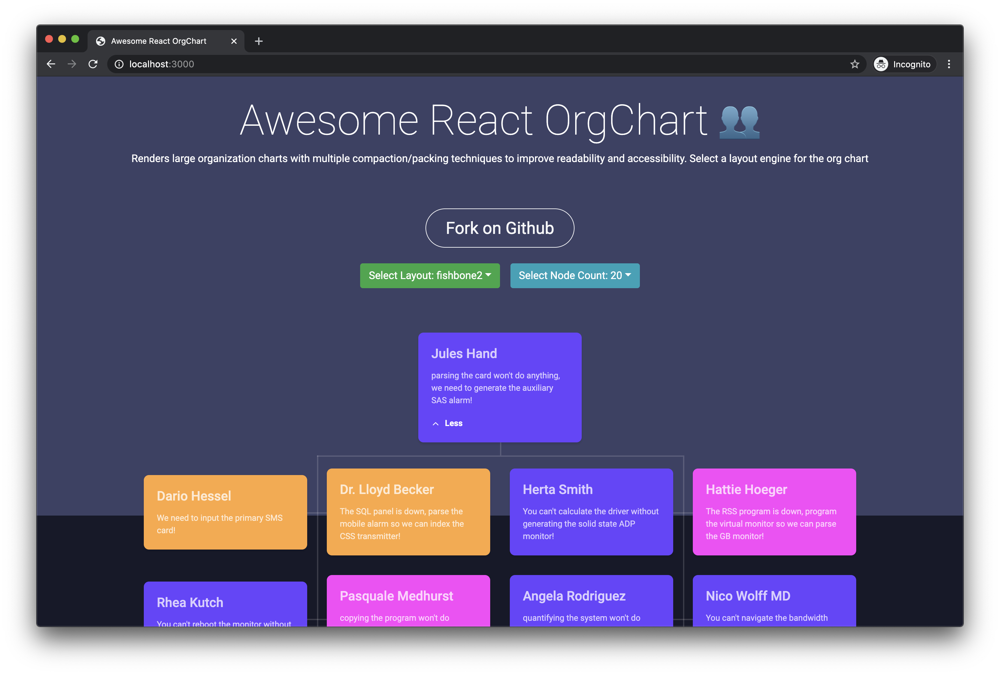

# Awesome React Org Chart 👥

[](https://badge.fury.io/js/awesome-react-org-chart)

Supports large organization charts with multiple compaction/packing techniques to improve readability and accessibility.

## [Example](https://awesome-react-org-chart.vercel.app/example.html)



```tsx
import OrgChart from "awesome-react-org-chart";

<OrgChart
  // required
  root={nodes[0]}
  isValidNode={this.isValidNode}
  keyGetter={this.keyGetter}
  renderNode={this.renderNode}
  childNodesGetter={this.childNodesGetter}
  // optional (but recommended)
  lineHorizontalStyle={this.lineHorizontalStyle}
  lineVerticalStyle={this.lineVerticalStyle}
  // optional
  measureStrategy="effect"
  connectorThickness={2}
  connectorAlignment={ConnectorAlignment.Center}
  isAssistantGetter={this.isAssistantGetter} // wip
  layout={layout}
  containerStyle={this.containerStyle}
  renderNodeContainer={this.renderNodeContainer}
  renderNodeLine={this.renderNodeLine}
  debug={debug}
/>;
```

## Animation

The OrgChart uses `transform3d` to position items on the screen. CSS transitions along with some React/JavaScript can be used to make animations.


## No React? [Example!](https://awesome-react-org-chart.vercel.app/public/vanilla.html)

The OrgChart does not need to use React. Please refer to the `VanillaExample.ts` file in the repo to learn more.

## Credits

[OrgChart](https://github.com/romanpolunin/OrgChart) by [@romanpolunin](https://github.com/romanpolunin)
